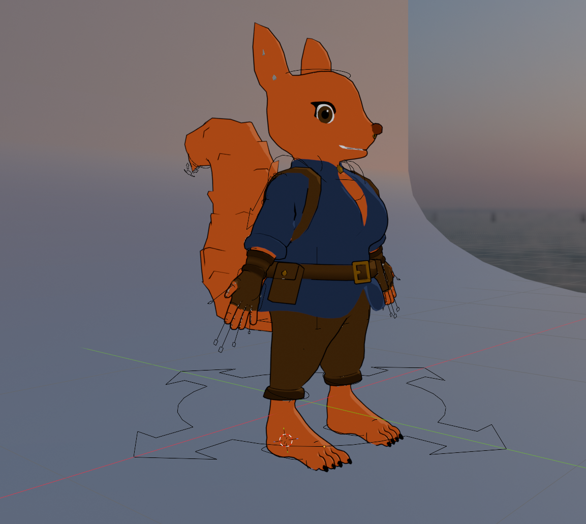
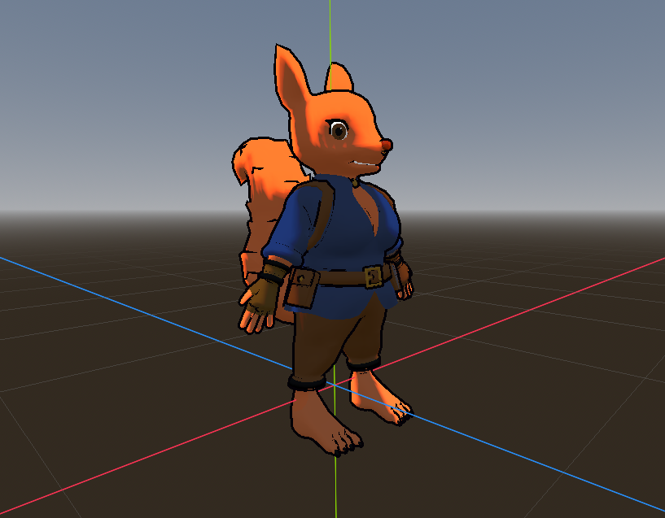

# Custom ~Squirrel Character Model
Custom character modeled/rigged/animated in Blender with Godot glb scene, including project files.

## Rigged Blender Model

## Godot Character Scene

## todo

- implement pose library
- blender animations
  - idle
  - walk
  - run
  - basic jump (start/cycle/land)
  - backflip
  - slide
  - rail-grind
- corresponding sound fx
- fur
  - polish tufts in Blender
  - try adding smaller hair cards and overlaying textures
    - scripting tufts, ear, and tail for wind sway
- polish godot outline shader
- shape key facial animations
- basic godot character controller for testing
- evaluate bone export types for data/profiler overhead

## Resources

Codernunk 3D Character Guide ([YT](https://youtu.be/dd6G2S6MQ6U))
